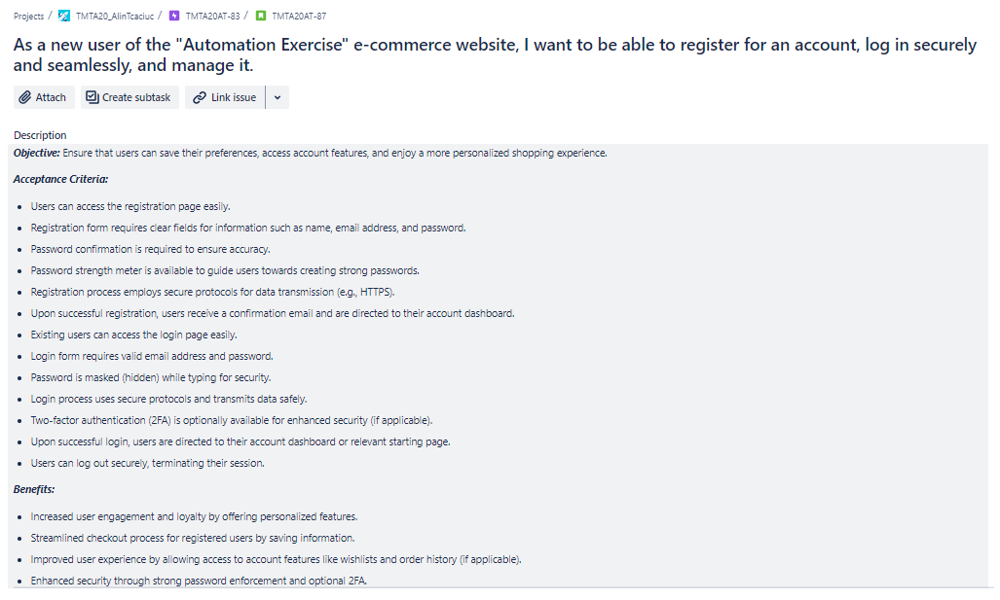
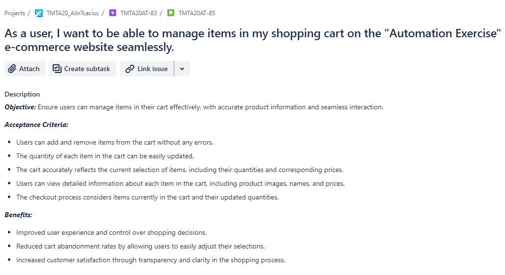
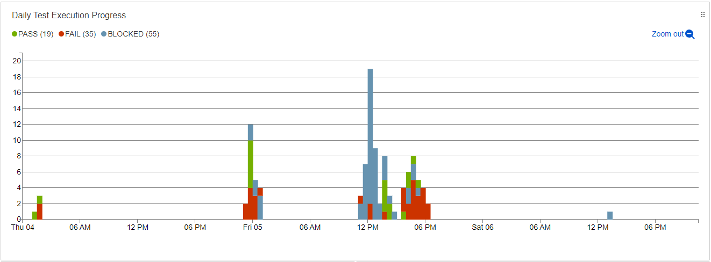
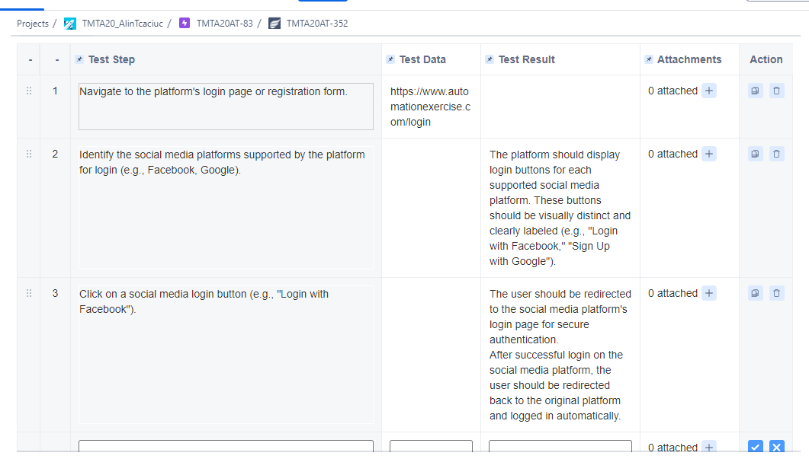
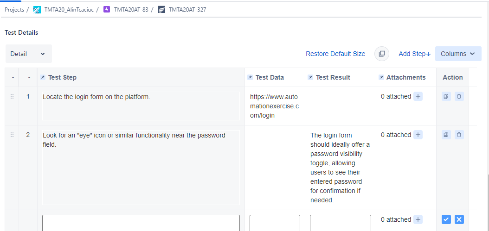
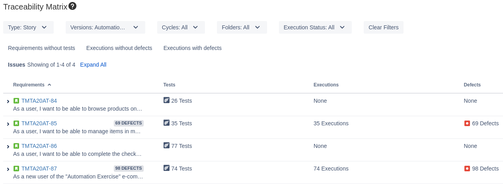
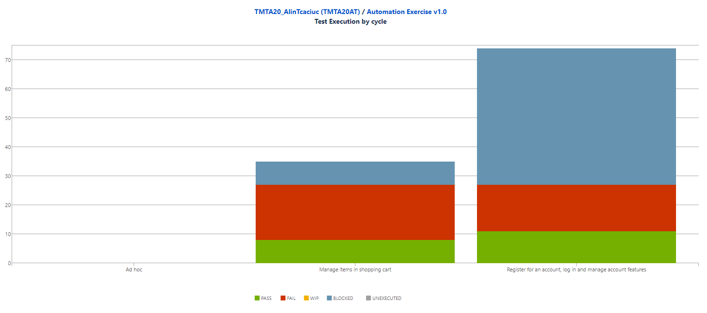

Testing Project for

\*\* Automation Exercise\*\* E-commerce Website

# Introduction:

The scope of the final project for ITF Manual Testing Course is to use all gained knowledge throught the course and apply them in practice, using a live application.

Application under test: [**Automation Exercise**](https://www.automationexercise.com/) e-commerce website

Automation Exercise este un site web destinat în special dezvoltatorilor și testerilor software care doresc să practice și să își îmbunătățească abilitățile de automatizare a testării, oferind un mediu controlat și variat pentru a simula diferite scenarii și a-și dezvolta abilitățile tehnice.

Tools used: Jira, Zephyr Squad.

# Functional specifications:

The below stories were created in Jira and describe the functional specifications of the following modules:

1.  Browse and search for products
2.  Manage items in the shopping cart
3.  Checkout process
4.  Signup/Login

Details cand be found at: LINK

For this final project were runed tests from following 2 modules:

-   Manage items in the shopping cart
-   Signup/Login

Here you can find the release that was created for this project:

****

****

**(inserati aici o poza cu release-ul pe care l-ati creat in jira. Atentie, release-ul nu va contine si teste, ci doar epic-uri, story-uri, task-uri, subtaskuri si bug-uri)**

# Testing process

The test process was performed based on the standard test process as described below.

## 1.1 Test planning

The Test Plan is designed to describe all details of testing for all the modules from the **Automation Exercise** e-commerce website.

The plan identifies the items to be tested, the features to be tested, the types of testing to be performed, the personnel responsible for testing, the resources and schedule required to complete testing, and the risks associated with the plan.

### 1.1.1. Roles asigned to the project and persons allocated

-   Project manager – Ion POPESCU
-   Product owner – Matei TUTUCA
-   Software developer – Albert CROITORU
-   QA Engineer – Alin TCACIUC

### 1.1.2 Entry criteria defined

-   **Requirements**: All functional and non-functional requirements must be clearly defined and approved.
-   **Environment**: The test environment should be fully set up and configured, including all necessary test data.
-   **Tools**: Jira and Zephyr Squad must be installed, configured, and accessible to the testing team.
-   **Resources**: All required human resources, including testers and developers, must be available.
-   **Documentation**: Test plan, test cases, and any necessary documentation must be completed and reviewed.

### 1.1.3 Exit criteria defined

-   **Test Case Execution**: All planned test cases must be executed.
-   **Defect Resolution**: All critical and high-priority defects must be resolved and retested.
-   **Coverage**: Achieve at least 95% test coverage for in-scope functionalities.
-   **Acceptance Criteria**: All acceptance criteria for the project must be met.
-   **Sign-Off**: Obtain formal sign-off from stakeholders confirming that all exit criteria have been met.

### 1.1.4 Test scope

**Tests in scope:**

-   **Functional Testing**: Validate core functionalities such as user registration, login, product browsing, adding items to the cart, and checkout.
-   **Regression Testing**: Ensure that new changes have not adversely affected existing functionality.
-   **Usability Testing**: Assess the user experience of key features.
-   **Cross-Browser Testing**: Verify the site works correctly on different web browsers (Chrome, Firefox, Safari, Edge).
-   **Responsive Testing**: Ensure the website is responsive and functions correctly on different devices (desktop, tablet, mobile).
-   **Accessibility Testing**: Ensure that platform adhere to accessibility best practices (e.g., proper color contrast, compatibility with screen readers).
-   Localization Testing: Test that the platform supports multiple languages

**Tests not in scope:**

-   **Performance Testing**: Load and stress testing will not be conducted.
-   **Security Testing**: Detailed security and penetration testing will be excluded.

### 1.1.5 Risks detected

#### Project Risks

##### Categories of Risks

1.  **Technical Risks:**
    -   **Risk:** Inability to correctly integrate test automation with existing infrastructure.
        -   **Severity:** Medium
        -   **Probability:** Medium
    -   **Risk:** Compatibility issues between different versions of the software used.
        -   **Severity:** Medium
        -   **Probability:** Low
2.  **Planning Risks:**
    -   **Risk:** Missing deadlines due to unexpected complexity of functionalities.
        -   **Severity:** High
        -   **Probability:** Medium
    -   **Risk:** Frequent changes in client requirements that may affect project progress.
        -   **Severity:** Medium
        -   **Probability:** Medium
3.  **Resource Risks:**
    -   **Risk:** Insufficient or inadequate human resources for developing and testing automation.
        -   **Severity:** High
        -   **Probability:** Low
    -   **Risk:** Lack of access to necessary hardware resources for load testing.
        -   **Severity:** Medium
        -   **Probability:** Medium
4.  **Quality Risks:**
    -   **Risk:** Significant deficiencies in automated testing that could lead to major defects in production.
        -   **Severity:** High
        -   **Probability:** Low
    -   **Risk:** Lack of adequate testing for different real-use scenarios.
        -   **Severity:** Medium
        -   **Probability:** Medium
5.  **Security Risks:**
    -   **Risk:** Security vulnerabilities in the session management system used in the web application.
        -   **Severity:** High
        -   **Probability:** Medium
    -   **Risk:** Exposure of users' personal data due to incorrect server configuration.
        -   **Severity:** High
        -   **Probability:** Low

##### Project Risk Prioritization Matrix

| Risc                                                                                          | Severitate (1-5) | Probabilitate (1-5) | Prioritate (Severitate x Probabilitate) |
|-----------------------------------------------------------------------------------------------|------------------|---------------------|-----------------------------------------|
| Inability to correctly integrate test automation with existing infrastructure.                | 3                | 3                   | 9                                       |
| Compatibility issues between different versions of the software used.                         | 3                | 2                   | 6                                       |
| Missing deadlines due to unexpected complexity of functionalities.                            | 4                | 3                   | 12                                      |
| Frequent changes in client requirements that may affect project progress.                     | 3                | 3                   | 9                                       |
| Insufficient or inadequate human resources for developing and testing automation.             | 4                | 2                   | 8                                       |
| Lack of access to necessary hardware resources for load testing.                              | 3                | 3                   | 9                                       |
| Significant deficiencies in automated testing that could lead to major defects in production. | 5                | 2                   | 10                                      |
| Lack of adequate testing for different real-use scenarios.                                    | 3                | 3                   | 9                                       |
| Security vulnerabilities in the session management system used in the web application.        | 4                | 2                   | 8                                       |
| Exposure of users' personal data due to incorrect server configuration.                       | 5                | 1                   | 5                                       |

###### Explanation:

-   **Severity (1-5):** A numerical assessment of the severity or impact of the risk on the project, where 1 is the lowest impact and 5 is the highest impact.
-   **Probability (1-5):** A numerical assessment of the likelihood of the risk materializing, where 1 is the lowest probability and 5 is the highest probability.
-   **Priority (Severity x Probability):** The result of multiplying severity by probability, representing the relative importance of each risk within the project. The higher the result, the more critical the risk, necessitating more careful management.

#### Product Risks

##### Story 2: Cart Management

1.  **Risk:** Add/remove product functionality in the cart not working correctly (critical error).
    -   **Severity:** High
    -   **Probability:** Medium
    -   **Mitigation Measures:** Implement robust automated tests for the add/remove product functionality. Continuously verify the integrity of the cart data.
2.  **Risk:** Unable to update product quantities in the cart or updates are not reflected correctly.
    -   **Severity:** Medium
    -   **Probability:** Medium
    -   **Mitigation Measures:** Rigorous testing of the quantity update functionality. Implement integration tests to check the correctness of updates in interaction with other modules.
3.  **Risk:** Discrepancies between products in the cart and those displayed (quantity, prices, images).
    -   **Severity:** Medium
    -   **Probability:** Medium
    -   **Mitigation Measures:** Periodic verification of data synchronization between the shopping cart and the product database. Implement automatic reconciliation mechanisms for displayed information.
4.  **Risk:** Missing complete product details in the cart (images, names, prices).
    -   **Severity:** Medium
    -   **Probability:** Medium
    -   **Mitigation Measures:** Ensure data integrity through tests displaying product details in the cart. Consistently monitor images and information associated with each product.
5.  **Risk:** Checkout process does not consider cart updates (quantities, prices).
    -   **Severity:** Medium
    -   **Probability:** Medium
    -   **Mitigation Measures:** Thorough testing of the checkout functionality in the context of cart changes. Implement rapid data synchronization mechanisms in real time.

##### Story 4: New User Registration & account management

1.  **Risk:** Difficulty accessing the registration page.
    -   **Severity:** Medium
    -   **Probability:** Medium
    -   **Mitigation Measures:** Continuous testing of the registration page accessibility on various platforms and devices. Implement uptime monitoring mechanisms for critical pages.
2.  **Risk:** Registration form has unclear labels or fields.
    -   **Severity:** Medium
    -   **Probability:** Medium
    -   **Mitigation Measures:** Review and adjust form field labels for clarity. Implement usability tests to evaluate the user experience.
3.  **Risk:** Lack of password confirmation or incorrect confirmation.
    -   **Severity:** Medium
    -   **Probability:** Medium
    -   **Mitigation Measures:** Implement real-time password confirmation verification in the registration form. Exhaustively test scenarios of incorrect password entry.
4.  **Risk:** Lack of a password strength indicator or ineffective indicator.
    -   **Severity:** Medium
    -   **Probability:** Medium
    -   **Mitigation Measures:** Implement a robust password strength indicator. Test various password creation scenarios to evaluate the indicator's effectiveness.
5.  **Risk:** Use of insecure protocols (non-HTTPS) during registration.
    -   **Severity:** High
    -   **Probability:** Medium
    -   **Mitigation Measures:** Implement HTTPS for all critical registration pages and personal data transmission. Constantly verify security certificates.
6.  **Risk:** Issues with sending registration confirmation emails.
    -   **Severity:** Medium
    -   **Probability:** Medium
    -   **Mitigation Measures:** Implement a mechanism to monitor the sending of confirmation emails. Test email sending in a separate test environment.
7.  **Risk:** Issues accessing the login page.
    -   **Severity:** Medium
    -   **Probability:** Medium
    -   **Mitigation Measures:** Continuous testing of the login page accessibility. Implement automatic error reporting mechanisms for access issues.
8.  **Risk:** Login form does not correctly validate authentication data.
    -   **Severity:** Medium
    -   **Probability:** Medium
    -   **Mitigation Measures:** Implement a robust system for validating authentication data. Test various failed authentication scenarios.
9.  **Risk:** Lack of password masking during typing (security issues).
    -   **Severity:** High
    -   **Probability:** Medium
    -   **Mitigation Measures:** Implement password masking for the login form. Test data security during password entry.
10. **Risk:** Use of insecure protocols (non-HTTPS) during login.
    -   **Severity:** High
    -   **Probability:** Medium
    -   **Mitigation Measures:** Implement HTTPS for all authentication processes and login data transmission. Constantly verify security certificates.
11. **Risk:** Faulty or missing 2FA functionality (if applicable).
    -   **Severity:** Medium
    -   **Probability:** Medium
    -   **Mitigation Measures:** Implement a robust 2FA functionality. Test various authentication scenarios with 2FA enabled or disabled.
12. **Risk:** Issues redirecting to the account page after login.
    -   **Severity:** Medium
    -   **Probability:** Medium
    -   **Mitigation Measures:** Implement a robust redirection mechanism and verify the correctness of navigation after authentication.
13. **Risk:** Insecure logout functionality (active session after logout).
    -   **Severity:** Medium
    -   **Probability:** Medium
    -   **Mitigation Measures:** Implement a secure logout process, including proper deletion of active sessions. Rigorously test the logout functionality under various conditions.

##### Product Risk Prioritization Matrix

###### Story 2: Cart Management

| Risk                                                                                      | Severity (1-5) | Probability (1-5) | Priority (Severity x Probability) |
|-------------------------------------------------------------------------------------------|----------------|-------------------|-----------------------------------|
| Add/remove product functionality in the cart not working correctly (critical error)       | 4              | 3                 | 12                                |
| Unable to update product quantities in the cart or updates are not reflected correctly    | 3              | 3                 | 9                                 |
| Discrepancies between products in the cart and those displayed (quantity, prices, images) | 3              | 3                 | 9                                 |
| Missing complete product details in the cart (images, names, prices)                      | 3              | 3                 | 9                                 |
| Checkout process does not consider cart updates (quantities, prices)                      | 3              | 3                 | 9                                 |

###### Story 4: New User Registration & account management

| Risk                                                        | Severity (1-5) | Probability (1-5) | Priority (Severity x Probability) |
|-------------------------------------------------------------|----------------|-------------------|-----------------------------------|
| Lack of password strength indicator                         | 3              | 3                 | 9                                 |
| Use of insecure protocols (non-HTTPS) during registration   | 4              | 3                 | 12                                |
| Issues with sending registration confirmation emails        | 3              | 3                 | 9                                 |
| Issues accessing the login page                             | 3              | 3                 | 9                                 |
| Login form does not correctly validate authentication data  | 3              | 3                 | 9                                 |
| Lack of password masking during typing (security issues)    | 4              | 3                 | 12                                |
| Use of insecure protocols (non-HTTPS) during login          | 4              | 3                 | 12                                |
| Faulty or missing 2FA functionality (if applicable)         | 3              | 3                 | 9                                 |
| Issues redirecting to the account page after login          | 3              | 3                 | 9                                 |
| Insecure logout functionality (active session after logout) | 3              | 3                 | 9                                 |
| Lack of password strength indicator                         | 3              | 3                 | 9                                 |
| Use of insecure protocols (non-HTTPS) during registration   | 4              | 3                 | 12                                |
| Issues with sending registration confirmation emails        | 3              | 3                 | 9                                 |

Explanation:

-   **Severity (1-5):** A numeric evaluation of the impact or severity of the risk on the product, where 1 signifies the least impact and 5 signifies the highest impact.
-   **Probability (1-5):** A numeric evaluation of the likelihood of the risk occurring during the project, where 1 represents the lowest probability and 5 represents the highest probability.
-   **Priority (Severity x Probability):** The product of severity and probability, indicating the relative importance of each risk within the context of the product. Higher values indicate higher priority for risk management and mitigation efforts.

These prioritization matrices help in focusing efforts on managing and mitigating risks based on their potential impact and likelihood of occurrence. Each risk's priority score guides the allocation of resources and attention to effectively address potential issues throughout the project lifecycle.

### 1.1.6 Evaluating entry criteria

The entry criteria defined in the Test Planning phase have been achieved and the test process can continue.

## 1.2 Test Monitoring and Control

**(inserati aici motivul pentru care a fost facuta etapa de monitorizare si control si respectiv cum s-a facut aceasta etapa. Aici veti insera de asemenea si raportul de status (test status report) din zephyr - test metrics - primul din lista care sa reflecte activitatea si evolutia testarii. Recomand aici sa executati teste aproape in fiecare zi ca sa vada angajatorul implicarea voastra in testare)**

Monitoring and control ensure that testing progresses according to plan and any deviations are addressed promptly. This includes daily status meetings, progress tracking in Jira, and regular test status reports from Zephyr Squad.

**Test Status Report**: A report from Zephyr reflecting test activities and progress is included below, showing metrics such as tests executed, passed, failed, and blocked.

## 1.3 Test Analysis

The testing process will be executed based on the application requirements.

The following are some examples of test conditions:

**(aici puteti fie sa puneti o poza din jira cu titlurile tuturor testelor - din issues filtrare dupa type test sau sa scrieti cu bulinuta numele fiecarei conditii de testare pe care ati identificat-o)**

## 1.4 Test Design

Functional test cases were created in Zephyr Squad based on the analysis of the specifications. These test cases cover various aspects of the project and are used to assess its correctness and performance for the platform functionalities.

The list of all the test cases created, along with their results can be accessed here **(inserati linkul catre fisierul cu testele, in format pdf, word sau csv)**

### Story 2: Cart Management

-   Verify that the cart display clearly communicates any changes in taxes or other additional charges (e.g., handling fees) that might be applied based on the cart content or user's location.
-   Verify that the platform accurately reflects changes in shipping costs within the total price when the cart value falls below the threshold for free shipping offers.
-   Verify that the cart total price is calculated accurately, considering both the updated quantities of items and any potential changes in their individual prices (e.g., due to variations or promotions).
-   Verify that the cart total price updates dynamically and accurately whenever there are changes in item quantity or removal of items from the cart.
-   Verify the platform's behavior when users choose to remove all items from the cart at once.
-   Verify that removing an item from the cart accurately updates the cart content and total price in real-time.
-   Verify that the platform prompts users for confirmation before permanently removing an item from the cart.
-   Verify that the shopping cart offers users clear and easily accessible options to remove unwanted items from the cart.
-   Verify that the shopping cart provides appropriate validation messages when users attempt to enter invalid quantities for items (e.g., negative values, exceeding stock limits)
-   Verify that the options for modifying item quantities within the shopping cart function properly and are accessible across different devices (desktop, mobile, tablet).
-   Verify that changes made to the quantity of items using the provided options are reflected instantly and accurately in the cart display.
-   Verify that the shopping cart offers users options to increase or decrease the quantity of each added item.
-   Verify the platform's behavior when adding the same item multiple times to the cart, with different variations chosen for each addition
-   Verify that the shopping cart dynamically updates the chosen variations (e.g., color, size) for items when users modify their selections within the cart
-   Verify that the shopping cart accurately reflects any changes made to the quantity of added items
-   Verify that the shopping cart content updates with minimal delay after users add or remove items.
-   Verify that the shopping cart clearly displays any applicable taxes and other charges (e.g., shipping costs) alongside the subtotal and total price
-   Verify that the total price in the shopping cart updates dynamically and accurately whenever there are changes in item quantity or chosen variations.
-   Verify that the shopping cart accurately calculates the total price when items with variations (e.g., different colors and prices) are added.
-   Verify that the total price displayed in the shopping cart accurately reflects the sum of individual item prices multiplied by their respective quantities
-   Verify that the layout and formatting of item details within the shopping cart promote readability and clarity for users
-   Verify that the shopping cart accurately reflects the specific variations (e.g., color, size) chosen for each item when products offer variations
-   Verify that the shopping cart accurately displays the item name, quantity and price for each added item
-   Verify that the shopping cart accurately displays an image for each item added, corresponding to the chosen product variation (if applicable)
-   Verify that the cart icon/indicator updates consistently and displays information accurately across different web browsers and devices (desktop, mobile, tablet) using the browser Developer tools
-   Verify that the cart icon/indicator provides a visual representation of the added item(s), if applicable. This could be a small image, icon, or other visual cue
-   Verify that the cart icon/indicator accurately displays the total number of items currently present in the user's shopping cart
-   Verify that the cart icon/indicator reflects the addition of an item to the cart with minimal delay.
-   Verify that the platform provides clear validation messages or feedback when users enter invalid values for quantity selection (e.g., non-numeric characters, negative numbers)
-   Verify that the quantity selection mechanism enforces any defined minimum and maximum order limits for specific products
-   Verify that users can successfully select different quantities of a product using the available methods (drop-down menu or input field)
-   Verify that all product pages within the platform allow users to select the quantity of the product they wish to add to their cart.
-   Verify that the "Add to Cart" button functions correctly and remains visually appealing across different devices and screen sizes
-   Verify that the "Add to Cart" button (or similar button for adding items) is easily identifiable, clickable, and has a clear and concise label
-   Verify that the "Add to Cart" button is present and functional on all product pages within the platform

### Story 4: New User Registration & account management

-   Verify that error messages are localized for different languages and consider accessibility needs (e.g., color contrast, screen reader compatibility)
-   Verify that error messages not only identify the problem but also provide clear instructions or suggestions for users to resolve it
-   Verify that the platform displays informative error messages when users provide invalid inputs or attempt incorrect actions
-   Verify that the platform's interfaces are responsive and maintain a consistent layout across different screen sizes (desktop, mobile).
-   Verify that the platform incorporates recognizable branding elements and maintains an intuitive user flow throughout registration, login, and account management.
-   Verify that the platform maintains a consistent visual design, logo, and color scheme throughout the registration, login, and account management interfaces.
-   Verify that the registration, login, and account management interfaces comply with accessibility standards and function properly across different devices (desktop, mobile)
-   Verify that the layout of registration, login, and account management interfaces is user-friendly and navigation is intuitive
-   Verify that all form fields within registration, login, and account management interfaces have clear and concise labels and instructions.
-   Verify that the platform operates in accordance with data privacy regulations and obtains user consent for email tracking practices.
-   Verify that the platform provides reporting and analytics functionalities that allow users to evaluate campaign performance.
-   Verify that the platform tracks key metrics like email opens, clicks on links within emails, and conversions resulting from email campaigns
-   Verify that users have options to manage their email communication preferences and opt-out of unwanted emails.
-   Verify that automated emails are personalized with relevant user information and targeted offers.
-   Verify that the platform automatically triggers emails based on predefined user actions or purchase history
-   Verify that the platform's integration with the chosen email marketing platform is compatible with existing tools and workflows within the email marketing platform.
-   Verify that user information and data are transferred securely between the platform and the email marketing platform.
-   Verify that the platform successfully establishes a connection and integrates with the chosen email marketing platform
-   Verify that 2FA prompts and verification processes are integrated seamlessly within the platform's user flow, avoiding disruptions.
-   Verify that enabling 2FA as an optional security measure prompts for verification codes during login attempts
-   Verify that 2FA is mandatory for specific sensitive actions within the platform, such as changing passwords
-   Verify that the platform successfully validates and links the chosen 2FA method to the user's account
-   Verify that the platform delivers verification codes promptly through the user's chosen communication channel (SMS or email) during 2FA
-   Verify that the platform provides clear and intuitive steps for users to set up and activate 2FA
-   Verify that the platform integrates seamlessly with the chosen communication channel (SMS or email) for sending 2FA verification codes.
-   Verify that the platform allows users to choose their preferred method for receiving 2FA verification codes (e.g., SMS or email).
-   Verify that the platform offers a 2FA option for account security and provides clear instructions for activation
-   Verify that the platform revokes social media access tokens when users disconnect their social media accounts
-   Verify that the platform implements mechanisms for social media access token expiration and renewal
-   Verify that social media access tokens are not transmitted or stored in a way that exposes them to unauthorized parties
-   Verify that the platform stores social media access tokens securely and uses encryption to protect them
-   Verify that the platform retrieves and maps relevant user data from social media platforms during social login or registration
-   Verify that successful login using social media credentials grants users access to their accounts on the platform
-   Verify that users can successfully register for a new account on the platform using their valid social media credentials
-   Verify that secure communication is being used with social media platforms, even though directly examining their internal security practices might be limited.
-   Verify that the login process using social media credentials is smooth and user-friendly
-   Verify that the platform offers login buttons for the social media platforms
-   Verify that the platform enforces strong password requirements consistently across all access points (web browser, mobile app, etc.)
-   Verify that the platform limits the number of password change attempts within a specific timeframe to prevent brute-force attacks
-   Verify that the platform prevents users from reusing their current password when setting a new one
-   Verify that the platform provides confirmation upon successful password changes and optionally sends email notifications
-   Verify that the platform requires confirmation of the current password and enforces new password requirements during password changes
-   Verify that the platform provides an option for users to change their passwords within their account settings
-   Verify that the platform provides options for filtering and sorting the user's order history for better organization.
-   Verify that the platform provides access to order tracking information and shipment updates for past orders.
-   Verify that the platform displays a list of the user's past orders with accurate details
-   Verify that the platform provides confirmation messages and validates the information entered during profile edits
-   Verify that the platform successfully saves and updates user profile information after edits are made
-   Verify that the platform allows users to edit specific profile details within their profile section
-   Verify that the platform provides clear and accessible options for users to access and edit their profile information
-   Verify that the platform updates user profile information accurately after edits are made by the user.
-   Verify that the platform accurately displays username, email address, and address information associated with the logged-in user's account.
-   Verify that the platform implements CAPTCHA challenges or similar measures to hinder automated login attempts
-   Verify that the platform temporarily locks accounts after exceeding login attempt limits
-   Verify that the platform enforces login attempt limits to restrict excessive login attempts
-   Verify that the platform implements session expiration and automatic logout after a period of inactivity
-   Verify that the platform utilizes unique and time-bound tokens for user identification during sessions.
-   Verify that the platform establishes and maintains secure user sessions after successful login
-   Verify that the platform handles failed login attempts with incorrect email addresses or passwords
-   Verify that the platform allows successful login for users with valid email addresses and passwords
-   Verify that the login form offers the option for users to see or hide their entered password while typing
-   Verify that the login form has clear labels for each field and offers easily accessible instructions, if needed
-   Verify that the login form includes all necessary fields for user login
-   Verify that confirmation emails are delivered successfully to various email providers and platforms
-   Verify that the confirmation email content includes relevant information and an activation link
-   Verify that the platform sends a confirmation email to the email address provided during registration
-   Verify that the platform utilizes secure transport protocols (HTTPS) during user registration to protect password transmission.
-   Verify that the platform provides clear error messages guiding users to create stronger passwords
-   Verify that the platform enforces password complexity requirements to promote strong passwords.
-   Verify that the platform's email validation rejects email addresses with invalid formats.
-   Verify that the platform's email validation accepts email addresses in standard formats
-   Verify that the signup forms offer the option for users to see or hide their entered password while typing.
-   Verify that the signup forms have clear labels for each field and easily accessible instructions if needed.
-   Verify that the signup form includes all necessary fields for user account creation

## 1.5 Test Implementation

The following elements need to be ready before the test execution phase begins:

-   Test environment setup.
-   Test data preparation.
-   Test scripts written and reviewed.
-   Necessary permissions and access granted.
-   Tools configured and validated.

## 1.6. Test Execution

Test cases are executed on the created test Cycle summaries:

-   *Manage items in shopping cart*
-   *Register for an account, log in and manage account features*

Bugs have been created based on the failed tests. The complete bug reports can be found here: **(inserati aici fisierul cu bug-urile pe care le-ati identificat)**

The following is a summary of the bugs that have been found for:

#### Story 2: Managing Items in the Shopping Cart

1.  **The platform doesn't provide a way of selecting quantities using the drop-down menu**
    -   **Prioritate:** Medie
    -   **Severitate:** Medie
2.  **The platform doesn't offer users the option that should prevent selecting a quantity below the minimum limit**
    -   **Prioritate:** Medie
    -   **Severitate:** Medie
3.  **The platform doesn't prevent users to enter a non-numeric character in the quantity input field**
    -   **Prioritate:** Înaltă
    -   **Severitate:** Înaltă
4.  **The platform doesn't prevent submitting a negative number in the quantity input field**
    -   **Prioritate:** Înaltă
    -   **Severitate:** Înaltă
5.  **The platform doesn't prevent submitting a value with decimals**
    -   **Prioritate:** Înaltă
    -   **Severitate:** Înaltă
6.  **The cart icon/indicator doesn't reflect the addition of an item to the cart**
    -   **Prioritate:** Înaltă
    -   **Severitate:** Înaltă
7.  **The cart icon/indicator doesn't display a small image or icon representing the added product**
    -   **Prioritate:** Scăzută
    -   **Severitate:** Scăzută
8.  **The products on the platform don't have variations (color, size, etc.)**
    -   **Prioritate:** Medie
    -   **Severitate:** Medie
9.  **The cart doesn't display a grand total price for all the items and quantities from it**
    -   **Prioritate:** Înaltă
    -   **Severitate:** Înaltă
10. **The cart doesn't offer users the possibility to modify the quantity of the added item**
    -   **Prioritate:** Înaltă
    -   **Severitate:** Înaltă
11. **The cart does not display any information about taxes or additional charges**
    -   **Prioritate:** Înaltă
    -   **Severitate:** Înaltă
12. **The platform doesn't display a clear error message indicating that negative values are not allowed**
    -   **Prioritate:** Înaltă
    -   **Severitate:** Înaltă
13. **The platform doesn't display a clear error message indicating that the chosen quantity is not available due to stock limitations**
    -   **Prioritate:** Înaltă
    -   **Severitate:** Înaltă
14. **The platform doesn't prompt users for confirmation before permanently removing an item from the cart**
    -   **Prioritate:** Medie
    -   **Severitate:** Medie
15. **The platform doesn't offer a dedicated "Remove All Items" or "Empty Cart" option**
    -   **Prioritate:** Scăzută
    -   **Severitate:** Scăzută
16. **The platform doesn't have promotions or discounts that might affect individual item prices**
    -   **Prioritate:** Medie
    -   **Severitate:** Medie
17. **The platform doesn't have a minimum cart value for free shipping**
    -   **Prioritate:** Medie
    -   **Severitate:** Medie

#### Story 4: User Registration, Login & Account Management

1.  **Password field doesn't have additional info**
    -   **Prioritate:** Medie
    -   **Severitate:** Medie
2.  **Mobile Number field doesn't have additional format info**
    -   **Prioritate:** Medie
    -   **Severitate:** Medie
3.  **Users cannot choose to view their password for confirmation purposes**
    -   **Prioritate:** Scăzută
    -   **Severitate:** Scăzută
4.  **The platform accepts email addresses with obvious formatting errors or invalid symbols**
    -   **Prioritate:** Înaltă
    -   **Severitate:** Înaltă
5.  **The platform allows users to create passwords that are too weak (e.g., short, lacking character variation)**
    -   **Prioritate:** Înaltă
    -   **Severitate:** Înaltă
6.  **The platform doesn't display an error message regarding password complexity**
    -   **Prioritate:** Înaltă
    -   **Severitate:** Înaltă
7.  **No confirmation email is sent after successful registration**
    -   **Prioritate:** Medie
    -   **Severitate:** Medie
8.  **The login form doesn't offer a password visibility toggle**
    -   **Prioritate:** Scăzută
    -   **Severitate:** Scăzută
9.  **The platform doesn't utilize unique and time-bound tokens for user identification during sessions**
    -   **Prioritate:** Înaltă
    -   **Severitate:** Înaltă
10. **The platform doesn't implement session expiration and automatic logout after a period of inactivity**
    -   **Prioritate:** Înaltă
    -   **Severitate:** Înaltă
11. **The platform doesn't limit the number of login attempts a user can make within a specific timeframe**
    -   **Prioritate:** Înaltă
    -   **Severitate:** Înaltă
12. **The platform doesn't use additional checks (e.g. CAPTCHA) to differentiate between legitimate users and bots**
    -   **Prioritate:** Înaltă
    -   **Severitate:** Înaltă
13. **The platform doesn't provide clear and accessible options for users to access and edit their profile information**
    -   **Prioritate:** Medie
    -   **Severitate:** Medie
14. **The platform doesn't display a list of the user's past orders**
    -   **Prioritate:** Medie
    -   **Severitate:** Medie
15. **The platform doesn't offer login buttons for the social media platforms**
    -   **Prioritate:** Medie
    -   **Severitate:** Medie
16. **The platform lacks a 2FA option for account security**
    -   **Prioritate:** Înaltă
    -   **Severitate:** Înaltă
17. **The platform lacks functionality for integrating with the chosen email marketing platform**
    -   **Prioritate:** Medie
    -   **Severitate:** Medie
18. **The platform doesn't automatically trigger emails based on predefined user actions or purchase history**
    -   **Prioritate:** Medie
    -   **Severitate:** Medie
19. **The platform doesn't adhere to accessibility best practices**
    -   **Prioritate:** Înaltă
    -   **Severitate:** Înaltă
20. **The platform does not allow users to change the language settings to a language other than the default**
    -   **Prioritate:** Medie
    -   **Severitate:** Înaltă

Full regression testing is needed on the impacted areas after the bugs are fixed and retesting will be done for every functionality that was previously failed.

## 1.7 Test Completion

### Traceability Matrix

The traceability matrix was generated and can be found here: TraceabilityMatrix

-   Regular updates to the Traceability matrix help maintain transparency and alignment between testing and project objectives throughout the test life cycle
-   The matrix indicates the current status of each test case, helping to monitor the testing process and identify any gaps or missing coverage
-   The matrix can be used for compliance purposes and to demonstrate that all requirements have been adequately tested and verified

### Test execution chart

Test execution chart was generated and can be found below.

### General Conclusions from Testing

#### Overview of User Stories and Tests:

1.  **Total User Stories:** 4
    -   Story 1: Browsing products (26 tests)
    -   Story 2: Managing items in the shopping cart (35 tests)
    -   Story 3: Completing the checkout process (77 tests)
    -   Story 4: User registration and login (74 tests)
2.  **Tests executed for User Stories:** 2 (109 tests)
    -   Story 2: Managing items in the shopping cart
    -   Story 4: User registration and login
3.  **Total Tests Written:** 212
    -   **Tests Executed:** 109 (51.42% of total tests)
    -   **Tests Not Executed:** 103 (48.58% of total tests)

#### Detailed Breakdown:

##### Story 2: Managing Items in the Shopping Cart

-   **Total Tests:** 35
-   **Passed:** 8 (22.86%)
-   **Failed:** 19 (54.29%)
-   **Blocked:** 8 (22.86%)

###### Identified Bugs:

1.  No minimum cart value for free shipping - Affects user expectation on free shipping.
2.  No promotions/discounts affecting item prices - Limits user attraction to offers.
3.  No "Remove All Items" or "Empty Cart" option - Inconvenient for bulk item removal.
4.  No confirmation prompt for removing items - Risk of accidental deletions.
5.  No error message for unavailable quantities - Confusion over stock levels.
6.  No error message for negative values - Incorrect input handling.
7.  No tax or additional charges information - Lack of cost transparency.
8.  No option to modify item quantity - Reduces flexibility in cart management.
9.  No grand total price display - User unaware of total cost.
10. No product variations (color, size, etc.) - Limited choice for users.
11. No product image/icon in cart indicator - Poor visual feedback.
12. Cart indicator not updating - Misleading cart status.
13. Accepts decimal values - Incorrect quantity entries.
14. Accepts non-numeric characters - Invalid input handling.
15. No minimum quantity limit - Possible errors in order quantities.
16. No drop-down menu for selecting quantities - Less user-friendly.
17. No prevention of submitting negative numbers - Incorrect input handling.

##### Story 4: User Registration and Login

-   **Total Tests:** 74
-   **Passed:** 11 (14.86%)
-   **Failed:** 16 (21.62%)
-   **Blocked:** 47 (63.51%)

###### Identified Bugs:

1.  No language settings - Limits accessibility for non-default language users.
2.  Non-adherence to accessibility best practices - Reduces usability for disabled users.
3.  No automated emails based on actions/purchase history - Poor communication.
4.  No email marketing integration - Missed marketing opportunities.
5.  No 2FA option - Security vulnerability.
6.  No social media login buttons - Reduces login convenience.
7.  No past order list - Poor user order tracking.
8.  No profile edit options - Limited account management.
9.  No CAPTCHA or bot checks - Security risk.
10. No login attempt limits - Susceptible to brute force attacks.
11. No session expiration/logout - Security risk from inactive sessions.
12. No unique/session tokens - Risk of session hijacking.
13. No password visibility toggle - Inconvenient for users.
14. No confirmation email post-registration - Poor onboarding process.
15. No password complexity error message - Weak passwords allowed.
16. Acceptance of weak passwords - Security vulnerability.
17. Acceptance of invalid email formats - User registration errors.
18. No mobile number format info - Input errors.
19. No password complexity info - Potential for weak passwords.
20. No password visibility toggle option - Reduces usability.

#### Severity of Identified Bugs:

**High Severity:**

-   **Security Issues:** No 2FA, no session expiration, no CAPTCHA, weak password acceptance.
-   **Usability Issues:** No error messages for invalid inputs, lack of feedback on cart actions.
-   **Accessibility Issues:** Non-adherence to best practices, no language settings.

    **Medium Severity:**

-   **Feature Limitations:** No profile editing, no past orders list, no social media login.
-   **Communication Issues:** No automated emails, no marketing integration.

    **Low Severity:**

-   **Minor Usability Enhancements:** No "Remove All Items" option, no password visibility toggle.
-   **Aesthetic and Minor Feedback Issues:** No product images in cart indicator, non-updating cart indicator.

### Conclusion:

The testing revealed significant gaps in both functionality and user experience, particularly in user registration, login, and cart management.

The identified bugs, especially those related to security and usability, greatly impact the final user experience, causing inconvenience and potential security risks.

Immediate attention to high-severity issues is essential to ensure a smooth and secure shopping journey for users on the "Automation Exercise" e-commerce website.
